# [📈 Live Status](https://querkmachine.github.io/status): <!--live status--> **🟩 All systems operational**

This repository contains the open-source uptime monitor and status page for [beeps](https://beeps.website/), powered by [Upptime](https://github.com/upptime/upptime).

With [Upptime](https://upptime.js.org), you can get your own unlimited and free uptime monitor and status page, powered entirely by a GitHub repository. We use [Issues](https://github.com/querkmachine/status/issues) as incident reports, [Actions](https://github.com/querkmachine/status/actions) as uptime monitors, and [Pages](https://querkmachine.github.io/status) for the status page.

<!--start: status pages-->
<!-- This summary is generated by Upptime (https://github.com/upptime/upptime) -->
<!-- Do not edit this manually, your changes will be overwritten -->
<!-- prettier-ignore -->
| URL | Status | History | Response Time | Uptime |
| --- | ------ | ------- | ------------- | ------ |
|  [[MAIN] beeps.website](https://beeps.website) | 🟩 Up | [main-beeps-website.yml](https://github.com/querkmachine/status/commits/HEAD/history/main-beeps-website.yml) | 

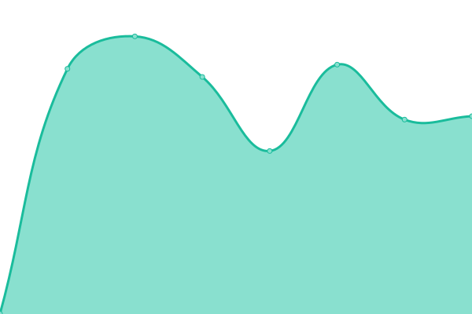 969ms
     
 | 

<a href="https://querkmachine.github.io/status/history/main-beeps-website">100.00%</a>
    

|  [[MAIN] beeps.gay](https://beeps.gay) | 🟩 Up | [main-beeps-gay.yml](https://github.com/querkmachine/status/commits/HEAD/history/main-beeps-gay.yml) | 

 1008ms
     
 | 

<a href="https://querkmachine.github.io/status/history/main-beeps-gay">100.00%</a>
    

|  [[MAIN] social.beeps.gay](https://social.beeps.gay) | 🟩 Up | [main-social-beeps-gay.yml](https://github.com/querkmachine/status/commits/HEAD/history/main-social-beeps-gay.yml) | 

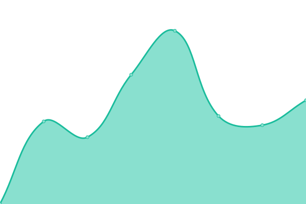 1033ms
     
 | 

<a href="https://querkmachine.github.io/status/history/main-social-beeps-gay">100.00%</a>
    

|  [PROJECT] BW | 🟩 Up | [project-bw.yml](https://github.com/querkmachine/status/commits/HEAD/history/project-bw.yml) | 

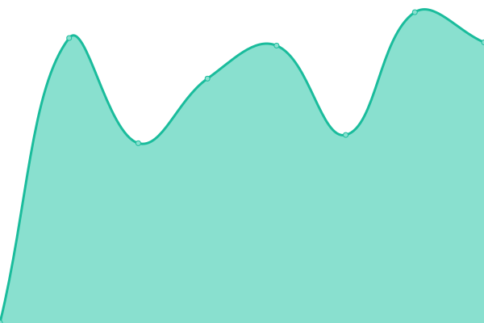 881ms
     
 | 

<a href="https://querkmachine.github.io/status/history/project-bw">100.00%</a>
    

|  [PROJECT] BW Stories  | 🟩 Up | [project-bw-stories.yml](https://github.com/querkmachine/status/commits/HEAD/history/project-bw-stories.yml) | 

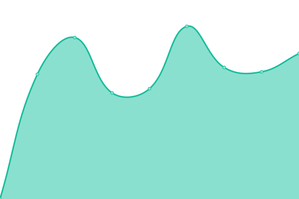 2378ms
     
 | 

<a href="https://querkmachine.github.io/status/history/project-bw-stories">100.00%</a>
    

|  [[PROJECT] Encyclopedia Robotica](https://encyclopediarobotica.org) | 🟩 Up | [project-encyclopedia-robotica.yml](https://github.com/querkmachine/status/commits/HEAD/history/project-encyclopedia-robotica.yml) | 

 580ms
     
 | 

<a href="https://querkmachine.github.io/status/history/project-encyclopedia-robotica">100.00%</a>
    

|  [[PROJECT] placeholder.rocks](https://placeholder.rocks) | 🟩 Up | [project-placeholder-rocks.yml](https://github.com/querkmachine/status/commits/HEAD/history/project-placeholder-rocks.yml) | 

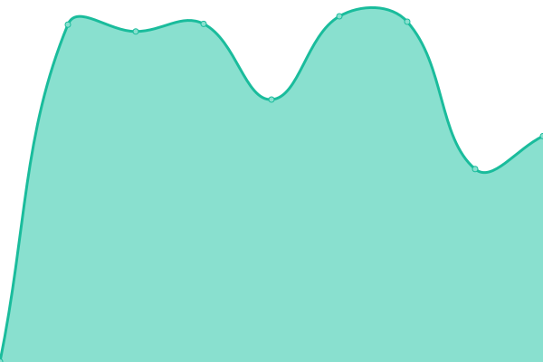 840ms
     
 | 

<a href="https://querkmachine.github.io/status/history/project-placeholder-rocks">100.00%</a>
    

|  [[PROJECT] placeponi.es](https://placeponi.es) | 🟩 Up | [project-placeponi-es.yml](https://github.com/querkmachine/status/commits/HEAD/history/project-placeponi-es.yml) | 

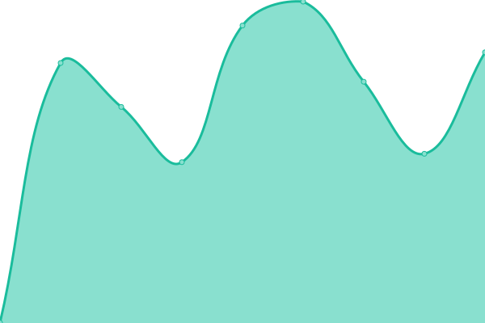 683ms
     
 | 

<a href="https://querkmachine.github.io/status/history/project-placeponi-es">100.00%</a>
    

|  [[PROJECT] The Software Bundle](https://bundle.software) | 🟩 Up | [project-the-software-bundle.yml](https://github.com/querkmachine/status/commits/HEAD/history/project-the-software-bundle.yml) | 

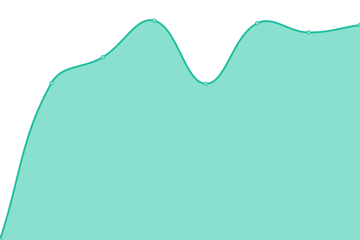 779ms
     
 | 

<a href="https://querkmachine.github.io/status/history/project-the-software-bundle">100.00%</a>
    

|  [[PLACEHOLDER] bird.horse](https://bird.horse) | 🟩 Up | [placeholder-bird-horse.yml](https://github.com/querkmachine/status/commits/HEAD/history/placeholder-bird-horse.yml) | 

 860ms
     
 | 

<a href="https://querkmachine.github.io/status/history/placeholder-bird-horse">100.00%</a>
    

|  [[PLACEHOLDER] bronies.wiki](http://bronies.wiki) | 🟩 Up | [placeholder-bronies-wiki.yml](https://github.com/querkmachine/status/commits/HEAD/history/placeholder-bronies-wiki.yml) | 

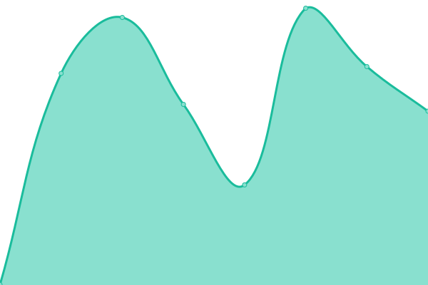 603ms
     
 | 

<a href="https://querkmachine.github.io/status/history/placeholder-bronies-wiki">100.00%</a>
    

|  [[ARCHIVE] Darn Blimps](https://darnblimps.com) | 🟩 Up | [archive-darn-blimps.yml](https://github.com/querkmachine/status/commits/HEAD/history/archive-darn-blimps.yml) | 

 731ms
     
 | 

<a href="https://querkmachine.github.io/status/history/archive-darn-blimps">100.00%</a>
    

|  [ARCHIVE] Emby | 🟩 Up | [archive-emby.yml](https://github.com/querkmachine/status/commits/HEAD/history/archive-emby.yml) | 

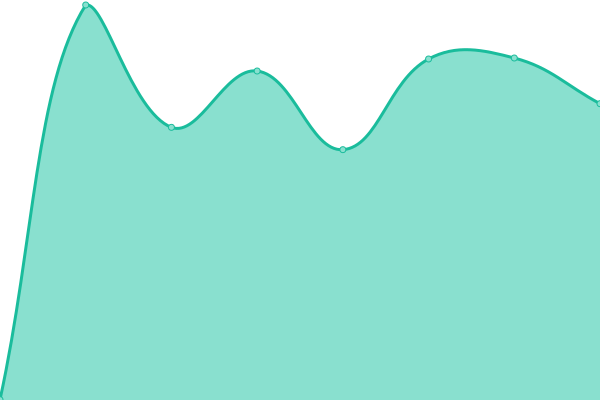 917ms
     
 | 

<a href="https://querkmachine.github.io/status/history/archive-emby">100.00%</a>
    

|  [[ARCHIVE] Public file store](https://files.beeps.gay/) | 🟩 Up | [archive-public-file-store.yml](https://github.com/querkmachine/status/commits/HEAD/history/archive-public-file-store.yml) | 

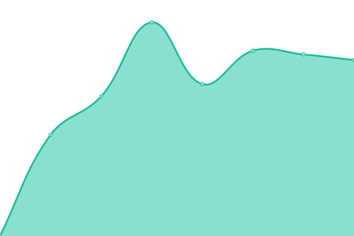 1338ms
     
 | 

<a href="https://querkmachine.github.io/status/history/archive-public-file-store">100.00%</a>
    

|  [[ARCHIVE] Kimgur](https://kimgur.com) | 🟩 Up | [archive-kimgur.yml](https://github.com/querkmachine/status/commits/HEAD/history/archive-kimgur.yml) | 

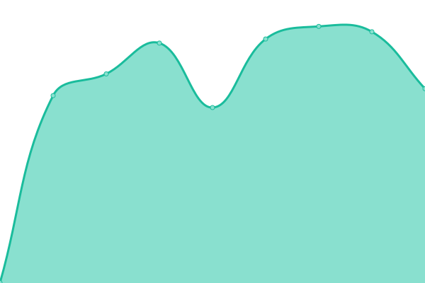 738ms
     
 | 

<a href="https://querkmachine.github.io/status/history/archive-kimgur">100.00%</a>
    

|  [[ARCHIVE] Projects archive](https://projects.berly.kim) | 🟩 Up | [archive-projects-archive.yml](https://github.com/querkmachine/status/commits/HEAD/history/archive-projects-archive.yml) | 

 1272ms
     
 | 

<a href="https://querkmachine.github.io/status/history/archive-projects-archive">100.00%</a>
    

|  [[ARCHIVE] Twitter archive](https://tweets.beeps.website) | 🟩 Up | [archive-twitter-archive.yml](https://github.com/querkmachine/status/commits/HEAD/history/archive-twitter-archive.yml) | 

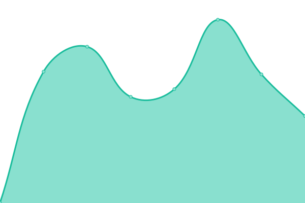 960ms
     
 | 

<a href="https://querkmachine.github.io/status/history/archive-twitter-archive">100.00%</a>
    

|  [[REDIRECT] berly.kim](https://berly.kim) | 🟩 Up | [redirect-berly-kim.yml](https://github.com/querkmachine/status/commits/HEAD/history/redirect-berly-kim.yml) | 

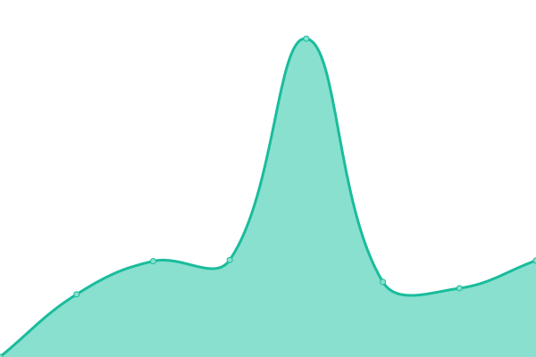 1444ms
     
 | 

<a href="https://querkmachine.github.io/status/history/redirect-berly-kim">100.00%</a>
    

|  [[REDIRECT] furrified.com](https://furrified.com) | 🟩 Up | [redirect-furrified-com.yml](https://github.com/querkmachine/status/commits/HEAD/history/redirect-furrified-com.yml) | 

 942ms
     
 | 

<a href="https://querkmachine.github.io/status/history/redirect-furrified-com">100.00%</a>
    

|  [[REDIRECT] greysadventures.com](https://greysadventures.com) | 🟩 Up | [redirect-greysadventures-com.yml](https://github.com/querkmachine/status/commits/HEAD/history/redirect-greysadventures-com.yml) | 

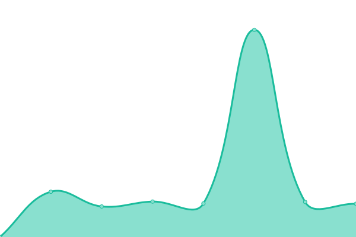 949ms
     
 | 

<a href="https://querkmachine.github.io/status/history/redirect-greysadventures-com">100.00%</a>
    

|  [[REDIRECT] robat.space](https://robat.space) | 🟩 Up | [redirect-robat-space.yml](https://github.com/querkmachine/status/commits/HEAD/history/redirect-robat-space.yml) | 

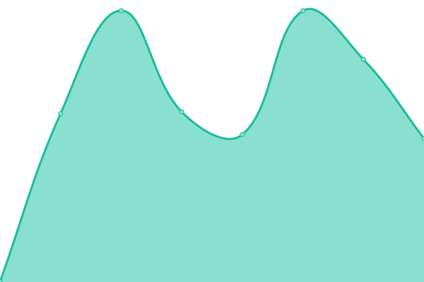 1306ms
     
 | 

<a href="https://querkmachine.github.io/status/history/redirect-robat-space">100.00%</a>
    

<!--end: status pages-->

[**Visit our status website →**](https://querkmachine.github.io/status)

## 📄 License

- Powered by: [Upptime](https://github.com/upptime/upptime)
- Code: [MIT](./LICENSE) © [Anand Chowdhary](https://anandchowdhary.com), supported by [Pabio](https://pabio.com)
- Data in the `./history` directory: [Open Database License](https://opendatacommons.org/licenses/odbl/1-0/)
