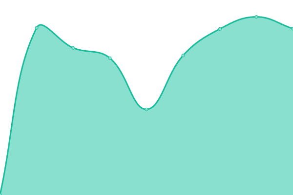
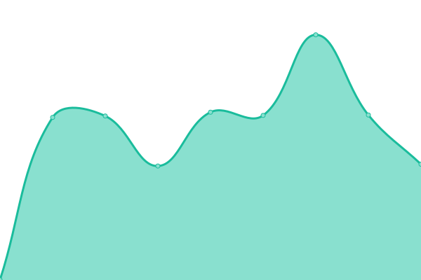
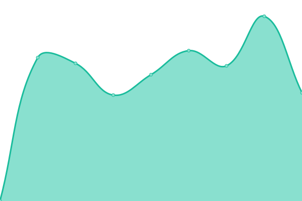

# [📈 Live Status](https://querkmachine.github.io/status): <!--live status--> **🟩 All systems operational**

This repository contains the open-source uptime monitor and status page for [beeps](https://beeps.website/), powered by [Upptime](https://github.com/upptime/upptime).

With [Upptime](https://upptime.js.org), you can get your own unlimited and free uptime monitor and status page, powered entirely by a GitHub repository. We use [Issues](https://github.com/querkmachine/status/issues) as incident reports, [Actions](https://github.com/querkmachine/status/actions) as uptime monitors, and [Pages](https://querkmachine.github.io/status) for the status page.

<!--start: status pages-->
<!-- This summary is generated by Upptime (https://github.com/upptime/upptime) -->
<!-- Do not edit this manually, your changes will be overwritten -->
<!-- prettier-ignore -->
| URL | Status | History | Response Time | Uptime |
| --- | ------ | ------- | ------------- | ------ |
|  [beeps.website](https://beeps.website) | 🟩 Up | [beeps-website.yml](https://github.com/querkmachine/status/commits/HEAD/history/beeps-website.yml) | 

 1105ms
     
 | 

<a href="https://querkmachine.github.io/status/history/beeps-website">100.00%</a>
    

|  [beeps.gay](https://beeps.gay) | 🟩 Up | [beeps-gay.yml](https://github.com/querkmachine/status/commits/HEAD/history/beeps-gay.yml) | 

 1288ms
     
 | 

<a href="https://querkmachine.github.io/status/history/beeps-gay">100.00%</a>
    

|  [social.beeps.gay](https://social.beeps.gay) | 🟩 Up | [social-beeps-gay.yml](https://github.com/querkmachine/status/commits/HEAD/history/social-beeps-gay.yml) | 

 1219ms
     
 | 

<a href="https://querkmachine.github.io/status/history/social-beeps-gay">100.00%</a>
    

|  [bird.horse](https://bird.horse) | 🟩 Up | [bird-horse.yml](https://github.com/querkmachine/status/commits/HEAD/history/bird-horse.yml) | 

 959ms
     
 | 

<a href="https://querkmachine.github.io/status/history/bird-horse">100.00%</a>
    

|  BW | 🟩 Up | [bw.yml](https://github.com/querkmachine/status/commits/HEAD/history/bw.yml) | 

 765ms
     
 | 

<a href="https://querkmachine.github.io/status/history/bw">100.00%</a>
    

|  BW Stories | 🟩 Up | [bw-stories.yml](https://github.com/querkmachine/status/commits/HEAD/history/bw-stories.yml) | 

 3264ms
     
 | 

<a href="https://querkmachine.github.io/status/history/bw-stories">100.00%</a>
    

|  [Darn Blimps](https://darnblimps.com) | 🟩 Up | [darn-blimps.yml](https://github.com/querkmachine/status/commits/HEAD/history/darn-blimps.yml) | 

 1021ms
     
 | 

<a href="https://querkmachine.github.io/status/history/darn-blimps">100.00%</a>
    

|  Emby | 🟩 Up | [emby.yml](https://github.com/querkmachine/status/commits/HEAD/history/emby.yml) | 

 841ms
     
 | 

<a href="https://querkmachine.github.io/status/history/emby">100.00%</a>
    

|  [Encyclopedia Robotica](https://encyclopediarobotica.org) | 🟩 Up | [encyclopedia-robotica.yml](https://github.com/querkmachine/status/commits/HEAD/history/encyclopedia-robotica.yml) | 

 635ms
     
 | 

<a href="https://querkmachine.github.io/status/history/encyclopedia-robotica">100.00%</a>
    

|  [Kimgur](https://kimgur.com) | 🟩 Up | [kimgur.yml](https://github.com/querkmachine/status/commits/HEAD/history/kimgur.yml) | 

 754ms
     
 | 

<a href="https://querkmachine.github.io/status/history/kimgur">100.00%</a>
    

|  [placeholder.rocks](https://placeholder.rocks) | 🟩 Up | [placeholder-rocks.yml](https://github.com/querkmachine/status/commits/HEAD/history/placeholder-rocks.yml) | 

 1362ms
     
 | 

<a href="https://querkmachine.github.io/status/history/placeholder-rocks">100.00%</a>
    

|  [placeponi.es](https://placeponi.es) | 🟩 Up | [placeponi-es.yml](https://github.com/querkmachine/status/commits/HEAD/history/placeponi-es.yml) | 

 914ms
     
 | 

<a href="https://querkmachine.github.io/status/history/placeponi-es">100.00%</a>
    

|  [Projects archive](https://projects.berly.kim) | 🟩 Up | [projects-archive.yml](https://github.com/querkmachine/status/commits/HEAD/history/projects-archive.yml) | 

 2167ms
     
 | 

<a href="https://querkmachine.github.io/status/history/projects-archive">100.00%</a>
    

|  [The Software Bundle](https://bundle.software) | 🟩 Up | [the-software-bundle.yml](https://github.com/querkmachine/status/commits/HEAD/history/the-software-bundle.yml) | 

 796ms
     
 | 

<a href="https://querkmachine.github.io/status/history/the-software-bundle">100.00%</a>
    

|  [Twitter archive](https://tweets.beeps.website) | 🟩 Up | [twitter-archive.yml](https://github.com/querkmachine/status/commits/HEAD/history/twitter-archive.yml) | 

 993ms
     
 | 

<a href="https://querkmachine.github.io/status/history/twitter-archive">100.00%</a>
    

|  [[REDIR] berly.kim](https://berly.kim) | 🟩 Up | [redir-berly-kim.yml](https://github.com/querkmachine/status/commits/HEAD/history/redir-berly-kim.yml) | 

 1990ms
     
 | 

<a href="https://querkmachine.github.io/status/history/redir-berly-kim">100.00%</a>
    

|  [[REDIR] furrified.com](https://furrified.com) | 🟩 Up | [redir-furrified-com.yml](https://github.com/querkmachine/status/commits/HEAD/history/redir-furrified-com.yml) | 

 953ms
     
 | 

<a href="https://querkmachine.github.io/status/history/redir-furrified-com">100.00%</a>
    

|  [[REDIR] greysadventures.com](https://greysadventures.com) | 🟩 Up | [redir-greysadventures-com.yml](https://github.com/querkmachine/status/commits/HEAD/history/redir-greysadventures-com.yml) | 

 1011ms
     
 | 

<a href="https://querkmachine.github.io/status/history/redir-greysadventures-com">100.00%</a>
    

|  [[REDIR] robat.space](https://robat.space) | 🟩 Up | [redir-robat-space.yml](https://github.com/querkmachine/status/commits/HEAD/history/redir-robat-space.yml) | 

 1324ms
     
 | 

<a href="https://querkmachine.github.io/status/history/redir-robat-space">100.00%</a>
    

<!--end: status pages-->

[**Visit our status website →**](https://querkmachine.github.io/status)

## 📄 License

- Powered by: [Upptime](https://github.com/upptime/upptime)
- Code: [MIT](./LICENSE) © [Anand Chowdhary](https://anandchowdhary.com), supported by [Pabio](https://pabio.com)
- Data in the `./history` directory: [Open Database License](https://opendatacommons.org/licenses/odbl/1-0/)
